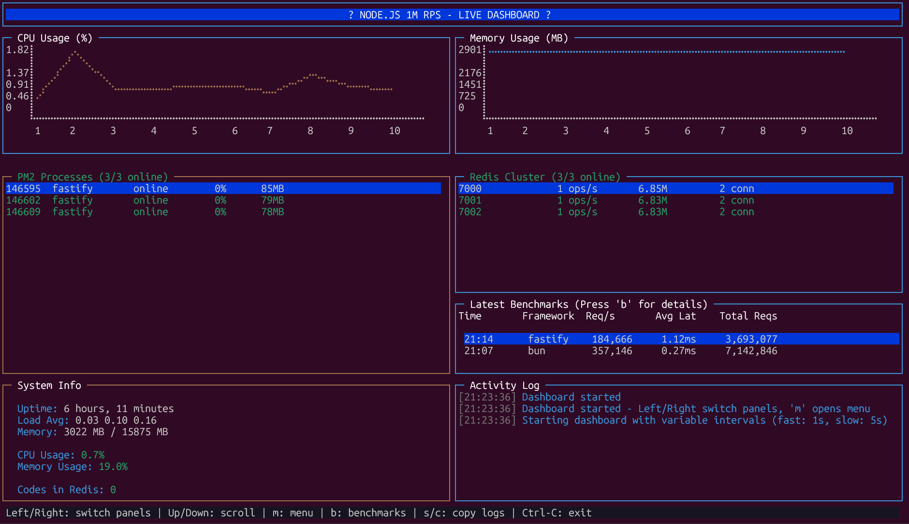

# Node.js 1M RPS Benchmark

High-performance Node.js application targeting 1 million requests per second. Originally from the [Handling 1 Million Requests per Second video](https://youtu.be/W4EwfEU8CGA). Redis-only (no PostgreSQL).

## Architecture

The project uses a **client-server architecture**:

- **API** (`api/`) – REST API + WebSocket server (port 3100) that runs on the machine where PM2 and Redis execute. Manages Redis cluster, PM2 processes, benchmarks, and system stats.
- **Dashboard** (`dashboard/`) – Terminal UI that connects to the API. Can run on the same machine or remotely (e.g. laptop connecting to a server).

```
┌─────────────────────┐         HTTP/WS          ┌─────────────────────┐
│     Dashboard       │ ◄───────────────────────► │        API           │
│  (terminal UI)      │      localhost:3100     │  (pm2, redis, etc)   │
│  npm run client     │                          │  npm run api          │
└─────────────────────┘                          └──────────┬──────────┘
                                                             │
                                    ┌────────────────────────┼────────────────────────┐
                                    │                        │                        │
                                    ▼                        ▼                        ▼
                             ┌──────────────┐        ┌──────────────┐        ┌──────────────┐
                             │ Redis Cluster│        │     PM2      │        │  Frameworks   │
                             │ (7000-7005)  │        │   (daemon)   │        │ Express, etc  │
                             └──────────────┘        └──────────────┘        └──────────────┘
```

## Quick Start

### 1. Install dependencies

```bash
npm install
```

### 2. Start the API server

The API must run on the machine where PM2 and Redis will run (usually your dev machine or a remote server):

```bash
npm run api
# or: node api/server.js
```

API runs at `http://localhost:3100` (configurable via `API_PORT`).

### 3. Start the Dashboard

In another terminal (can be a different machine):

```bash
npm run client
# or: node dashboard/index.js
```

The dashboard connects to `http://localhost:3100` by default. Use `API_SERVER` to point to a remote API:

```bash
API_SERVER=http://192.168.1.100:3100 npm run client
```

Or use **Utilities → Connect to API** in the dashboard menu to switch at runtime.

### 4. Run a benchmark

1. Open the menu (**m**)
2. Under **PM2 Cluster** → **Start Fastify (specify instances)** → enter e.g. `3`
3. Under **Redis Cluster** → **Setup Redis Cluster** → enter e.g. `6`
4. Under **Benchmarks** → pick a framework and endpoint

---

## Project Structure

```
node-1m-rps/
├── api/                    # API server (port 3100)
│   ├── config/             # Frameworks, ecosystem
│   ├── routes/             # PM2, Redis, benchmark, system
│   ├── scripts/            # pm2.js, redis.js, rps.js (CLI)
│   └── services/
├── dashboard/              # Terminal UI (connects to API)
│   ├── controllers/
│   ├── services/
│   └── ui/
├── frameworks/             # Benchmark target servers
│   ├── nodejs/             # Express, Fastify, Cpeak
│   ├── bun/                # Bun native
│   └── utils.js            # Shared Redis helpers
├── database/
│   └── redis.js            # Redis client (used by frameworks)
└── package.json
```

---

## Redis Cluster

**Redis Agent is mandatory** - the API always uses the Redis Agent for cluster management. The agent defaults to `http://localhost:3200` if `REDIS_AGENT_URL` is not set.

### Local Setup (Redis on same machine as API)

1. **Start the Redis Agent**:
   ```bash
   npm run redis-agent
   ```
   The agent runs on port 3200 (configurable via `REDIS_AGENT_PORT`).

2. **Start the API** (in another terminal):
   ```bash
   npm run api
   ```
   The API will automatically connect to the agent at `http://localhost:3200`.

3. **Setup Redis** via the dashboard or CLI:
   ```bash
   # Via dashboard: Menu → Redis Cluster → Setup Redis Cluster
   # Or via CLI on the Redis machine:
   node api/scripts/redis.js -setup -n 6
   ```

### Remote Setup (Redis on a separate machine)

For valid benchmarks with network latency between API and Redis:

1. **On the Redis machine** – clone the project, then:
   ```bash
   npm run redis-agent
   ```
   The agent runs on port 3200 (configurable via `REDIS_AGENT_PORT`).

2. **Setup Redis** – via agent or CLI on the Redis machine:
   ```bash
   node api/scripts/redis.js -setup -n 6 --bind-remote
   ```

3. **On the API machine** – start the API with:
   ```bash
   REDIS_AGENT_URL=http://<redis-machine-ip>:3200 REDIS_HOST=<redis-machine-ip> npm run api
   ```

   The API will proxy all Redis operations (setup, stop, status, etc.) to the agent. Frameworks connect to Redis via `REDIS_HOST`.

### Redis Script Options

```bash
# Setup 6-node cluster
node api/scripts/redis.js -setup -n 6

# Stop (auto-detects nodes)
node api/scripts/redis.js -stop

# Resume stopped nodes
node api/scripts/redis.js -resume

# Clean (stop + delete data)
node api/scripts/redis.js -clean
```

Options:
- `-n, --nodes <number>` – Node count (required for setup)
- `-r, --replicas <number>` – Replicas per master (default: 1)
- `-prod` – Use redis6-server/redis6-cli
- `--bind-remote` – Bind to 0.0.0.0 for remote access (setup only)

Cluster data is stored in `redis-cluster/` in the project root (configurable via `REDIS_CLUSTER_DIR`).

Run frameworks in cluster mode:

```bash
REDIS_CLUSTER=true node frameworks/nodejs/express.js
```

---

## PM2 & Frameworks

Frameworks are configured in `api/config/frameworks.config.js`. Start via PM2:

```bash
# Start a framework (e.g. fastify with 3 instances)
node api/scripts/pm2.js -start -f fastify -i 3

# Stop
node api/scripts/pm2.js -stop -f fastify

# Status
node api/scripts/pm2.js -status

# Logs
node api/scripts/pm2.js -logs
```

Or use the dashboard menu ( **m** → PM2 Cluster).

---

## Dashboard



| Key | Action |
|-----|--------|
| **m** | Open menu |
| **b** | Benchmark history overlay |
| **r** | Refresh |
| **←/→** | Switch panels |
| **s / c** | Copy logs (when log panel focused) |
| **ESC / q** | Close overlay / quit |

### Menu Sections

- **Redis Cluster** – Setup, stop, resume, clean, status
- **PM2 Cluster** – Start frameworks (with instance count), stop/restart/delete all
- **Benchmarks** – Run autocannon benchmarks per framework and endpoint
- **Utilities** – Connect to API, clear benchmark history

---

## Benchmarks

Benchmark endpoints:

- `GET /simple` – Framework overhead
- `POST /code` – Write throughput (Redis + validation)
- `GET /code-fast` – Read throughput (Redis lookup)

From the dashboard menu or CLI:

```bash
# Using rps CLI (if installed: npm link or npx rps)
npx rps bench fastify simple
npx rps bench fastify code
```

Or directly with autocannon:

```bash
npx autocannon -m GET -c 20 -d 20 -p 2 -w 6 http://localhost:3002/simple
```

---

## Environment Variables

| Variable | Default | Description |
|----------|---------|-------------|
| `API_SERVER` | `http://localhost:3100` | API URL (dashboard) |
| `API_PORT` | `3100` | API port |
| `API_KEY` | (none) | Optional API key for auth |
| `REDIS_CLUSTER` | `false` | `true` for Redis cluster mode |
| `REDIS_AGENT_URL` | `http://localhost:3200` | Redis Agent URL (mandatory - API always uses agent) |
| `REDIS_HOST` | `127.0.0.1` | Redis host (derived from REDIS_AGENT_URL if not set) |
| `REDIS_PORT` | `7000` (cluster) | Redis port |
| `REDIS_AGENT_PORT` | `3200` | Redis Agent port (when running `npm run redis-agent`) |
| `LOG_LEVEL` | `info` | Dashboard log level |
| `DASHBOARD_DEBUG` | (unset) | `1` to log to console |

---

## Adding New Runtimes

To add a new runtime (C#, Go, Rust, etc.):

1. **Implement the server** in `frameworks/<runtime>/` with endpoints:
   - `GET /simple`
   - `POST /code`
   - `GET /code-fast`

2. **Configure** in `api/config/frameworks.config.js`:

```javascript
go: {
  name: "go",
  displayName: "Go (Native)",
  port: 3005,
  color: "cyan",
  file: "frameworks/go/server",
  enabled: true,
  runtime: "go",
  interpreter: "none",
  execMode: "fork",
  instances: 1,
},
```

PM2, benchmarks, and the dashboard will pick it up automatically.

---

## RPS CLI

The `rps` CLI provides interactive and shortcut commands:

```bash
npx rps
# or, if linked: rps
```

Examples: `rps start`, `rps quickstart`, `rps redis setup`, `rps pm2 start fastify`, etc.
